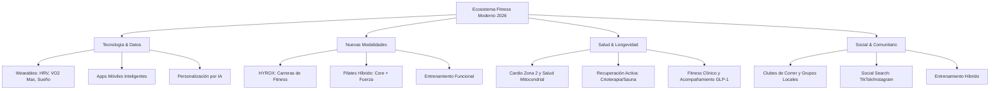

# Estudio de Tendencias: El Nicho de Fitness en Internet (2025 - 2026)

Este informe presenta un análisis exhaustivo del nicho del **fitness y el bienestar en internet** para el período 2025-2026. Los datos y estadísticas provienen de informes clave de la industria, incluyendo el estudio mundial de tendencias de la **ACSM (American College of Sports Medicine)**, reportes de consumo de **ABC Fitness**, **ClassPass**, y datos de engagement de redes sociales.

---

## 📊 Resumen Ejecutivo y Estadísticas Globales

La industria del fitness ha completado una transición profunda: **el fitness ya no es solo estética (culturismo y pérdida de peso rápida); es longevidad, datos de salud y comunidad**. 

### Estadísticas Clave del Mercado (2026)
*   **Valor del Mercado Global de Fitness:** Se estima entre **$134,000 millones y $145,000 millones de dólares para finales de 2026**, con una tasa de crecimiento anual compuesta (CAGR) del **8.2%** proyectada hasta 2035.
*   **Mercado de la Longevidad:** El mercado enfocado en longevidad y bienestar alcanzará los **$610,000 millones de dólares** en 2026.
*   **Mercado del Fitness Online:** El segmento digital (apps, coaching remoto, wearables) se proyecta que crezca de **$36,600 millones en 2026** a más de **$120,000 millones en 2031** (un impresionante **26.8% CAGR**).
*   **Bifurcación del Mercado (Efecto "Barbell"):** Las marcas que triunfan en internet y físicamente se dividen en dos extremos:
    1.  *High-Volume/Low-Price (Bajo Costo/Volumen):* Gimnasios de bajo costo enfocados en accesibilidad masiva.
    2.  *Premium/High-Touch (Premium/Especializados):* Estudios boutique y plataformas de coaching de alto valor con atención personalizada.
    3.  *El "medio" colapsa:* Los negocios tradicionales con precios medios y servicios genéricos están perdiendo cuota de manera acelerada.

---

## 📈 Top 5 Tendencias en Redes Sociales (TikTok, Instagram, YouTube)

El comportamiento de los usuarios en internet ha cambiado la forma de consumir fitness. La búsqueda tradicional en Google está siendo reemplazada por búsquedas visuales y dinámicas.

### 1. Dominio de la Búsqueda Social (Social Search)
*   **El Dato:** El **74% de la Generación Z** utiliza TikTok para realizar búsquedas en internet, y el **51% prefiere buscar rutinas de entrenamiento, explicaciones de ejercicios y consejos en TikTok/Instagram** antes que en Google.
*   **Implicación:** Los creadores y marcas de fitness deben optimizar su SEO de video (palabras clave en subtítulos, voz en off y hashtags de nicho) para capturar este tráfico.

### 2. Autenticidad sobre Perfección (UGC)
*   Las audiencias rechazan los comerciales hiper-producidos de celebridades o modelos con físicos inalcanzables. El contenido de tipo **UGC (User Generated Content)** y los **micro-creadores** (entre 10k y 100k seguidores) que muestran su progreso real y diario obtienen hasta **3 veces más confianza** que los macro-influencers.

### 3. Engagement Masivo en Fitness
*   El contenido de fitness en TikTok lidera con tasas de engagement promedio de **9.3%**, superando a la mayoría de categorías (moda, belleza, videojuegos).
*   Las campañas y patrocinios de marcas en esta categoría generan un retorno de inversión (ROI) estimado de **6.3x**, convirtiendo al nicho en uno de los más rentables para marketing de afiliados y patrocinios directos.

### 4. La Era del Fitness Híbrido
*   El **entrenamiento híbrido** (mezclar rutinas presenciales en el gimnasio con seguimiento, apps y videollamadas con un entrenador online) es el estándar. Los entrenadores que ofrecen este modelo híbrido en internet ganan sustancialmente más y retienen a sus clientes por más tiempo en comparación con los entrenadores puramente presenciales.

---

## 🚀 Desglose de los Sub-Nichos con Mejor Crecimiento

Si vas a crear contenido, un producto digital o un servicio de fitness en internet, estos son los tres sub-nichos específicos que están registrando las mejores estadísticas de crecimiento:

### A. HYROX (Carreras de Fitness y Entrenamiento de Competición)
HYROX es el fenómeno deportivo de mayor crecimiento a nivel mundial. Es una carrera que combina 8 km de running y 8 entrenamientos funcionales.

*   **Estadística de Crecimiento:** Pasó de tener **175,000 participantes en la temporada 2023/24** a más de **1.5 millones en la temporada 2025/26**. Las proyecciones para 2026/27 estiman superar los **2 millones de atletas**.
*   **En Internet:** Las búsquedas de "Rutinas para Hyrox", "Cómo mejorar en Hyrox" y los vlogs diarios de preparación física ("Prep Vlogs") están acumulando miles de millones de visualizaciones. Se ha convertido en el nuevo "CrossFit" pero con una barrera de entrada mucho menor, lo que atrae al público general.

### B. Pilates Híbrido (Pilates + Fuerza)
El Pilates ha dejado de ser visto como una disciplina exclusivamente suave o de estiramiento.

*   **Estadística de Crecimiento:** En plataformas de reserva como ClassPass, el Pilates se mantiene en el top de reservas globales, registrando incrementos de hasta un **66% de crecimiento interanual**.
*   **La Tendencia de Fusión:** La tendencia en redes sociales en 2026 es el **Pilates con Peso** o **HIIT Pilates**, donde se integran mancuernas, bandas de alta resistencia e intervalos intensos para maximizar la hipertrofia del core y la quema de calorías sin perder el enfoque en la movilidad y postura.

### C. Longevidad y Cardio Zona 2
La conversación en internet liderada por médicos e investigadores de renombre (como el Dr. Peter Attia) ha calado hondo en el consumidor promedio.

*   **Estadística de Consumo:** Más del **33% de los usuarios de gimnasios y apps de fitness** citan la "longevidad" y la "salud cardiovascular futura" como su motivación principal, por encima de "lucir bien en la playa".
*   **Zona 2:** El término *"Cardio Zona 2"* (entrenamiento cardiovascular de baja intensidad que permite mantener una conversación) y el entrenamiento de fuerza para mantener la densidad ósea y masa muscular al envejecer son tendencias de búsqueda masivas.
*   **Recuperación Activa:** El uso de saunas, crioterapia (cold plunges), terapia de luz roja y el monitoreo de la **HRV (Variabilidad de la Frecuencia Cardíaca)** como indicador de recuperación son obligatorios en los planes de entrenamiento modernos creados en internet.

---

## 📊 Tabla Comparativa: Rendimiento de los Sub-Nichos

| Sub-Nicho | Público Objetivo | Nivel de Competencia | Tasa de Engagement Promedio | Oportunidades de Monetización |
| :--- | :--- | :--- | :--- | :--- |
| **HYROX / Carreras de Fitness** | Atletas recreativos, ex-deportistas de equipo, fans del running. | **Medio** (nicho en plena expansión rápida). | **Alta (8.5% - 11%)** por el sentido de comunidad. | Planes de entrenamiento digital, calzado, suplementación, coaching personalizado. |
| **Pilates Híbrido / Reformer** | Mayormente femenino (aunque el sector masculino crece rápido), amantes de la estética "tonificada" y movilidad. | **Alta** (muy popular, alta demanda de creadores visuales). | **Alta (7.5% - 9%)** por videos de "rutinas estéticas" y outfits. | Venta de rutinas en casa (sin equipamiento), programas premium, ropa deportiva. |
| **Longevidad y Biohacking** | Adultos de 30-55 años enfocados en salud mitocondrial, prevención y bienestar a largo plazo. | **Baja-Media** (requiere mayor autoridad/conocimiento técnico). | **Media-Alta (6% - 8%)** pero con gran fidelidad de audiencia. | Suplementos de longevidad, dispositivos wearables, consultoría uno a uno de salud integral. |
| **GLP-1 Companion Fitness** | Usuarios que toman medicamentos para perder peso y necesitan preservar masa muscular. | **Muy Baja** (nicho extremadamente nuevo y desatendido). | **Alta** (el público busca desesperadamente guías médicas/deportivas). | Planes de fuerza para prevención de sarcopenia, coaching de nutrición médica. |

---

## 💡 Oportunidades de Oro para Emprender en el Nicho de Fitness (2026)

Si buscas capitalizar este mercado a través de internet, aquí están las mejores oportunidades con base en estadísticas:

1.  **Programas de Fuerza "Companion" para usuarios de GLP-1 (Ozempic/Wegovy):** Con millones de personas utilizando estos fármacos, existe una necesidad crítica de entrenamiento de fuerza específico para evitar la pérdida acelerada de masa muscular.
2.  **Entrenadores Híbridos basados en Datos:** Crear servicios donde el cliente envíe sus reportes de salud semanales (sueño de Whoop/Oura Ring, HRV, pasos) y el entrenador adapte su rutina en base a la fatiga real del usuario.
3.  **Comunidades de "Fitness Social":** El éxito de HYROX y los clubes de correr demuestra que la gente busca conectarse. Aplicaciones o plataformas online que organicen eventos locales presenciales tienen altísima retención.
4.  **Micro-Especialización en TikTok/Reels:** Crear contenido exclusivamente enfocado en solucionar problemas puntuales (por ejemplo: "Pilates para personas con dolor lumbar" o "Cómo correr tu primer HYROX sin lesionarte").

---

> [!TIP]
> **Recomendación Estratégica:** Para destacar en el saturado mercado del fitness en internet, evita la tentación de ser un "entrenador generalista". Las mejores estadísticas de conversión y retención se encuentran en los **micro-nichos altamente definidos** (como la longevidad activa en adultos mayores de 50 años o el entrenamiento específico de HYROX).
