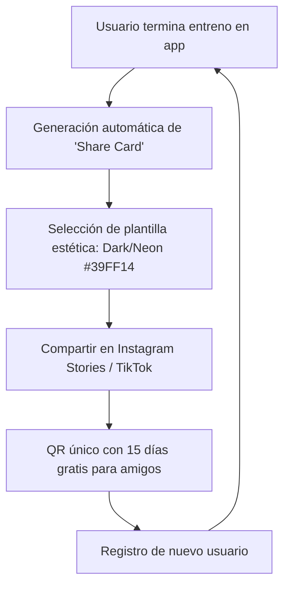

# Propuesta de Adaptación Estratégica: TJ FITLAB (2025 - 2026)

**TJ FITLAB** (www.tjfitlab.com) ya cuenta con una base sólida y moderna orientada al **Elite Hybrid Training** (HYROX, maratón y fuerza) y al análisis de datos. Sin embargo, para capitalizar al máximo las macrotendencias de 2026 y diferenciarse en internet, se pueden implementar adaptaciones clave en el posicionamiento de marca, la propuesta de valor del software/app y la estrategia de contenido.

A continuación, se detalla un informe ampliado con estrategias reales y acciones concretas para aumentar la viralidad en redes sociales, incorporar nuevas funcionalidades a la aplicación móvil y ejecutar con éxito los nichos y sub-nichos de mayor crecimiento en el sector del fitness.

---

## 1. De "Métricas de Entrenamiento" a "Métricas Biológicas" (Wearable Integration)

Actualmente, TJ FITLAB se enfoca en registrar repeticiones, kilómetros y calorías. 

> [!IMPORTANT]
> **Tendencia 2026:** El consumidor ya no solo quiere registrar lo que *hace*, sino cómo responde su *cuerpo* en tiempo real. La tecnología wearable es la tendencia #1 global.

### Adaptaciones Sugeridas:
*   **Integración Directa con APIs de Wearables:** Permitir que los atletas sincronicen sus dispositivos (Garmin, Whoop, Apple Watch, Oura, Polar) con la app de TJ FITLAB para centralizar métricas de fatiga, descanso y rendimiento.
*   **Ajuste por Fatiga Real (HRV-Driven):** Usar la **Variabilidad de la Frecuencia Cardíaca (HRV)** y la calidad del sueño de la noche anterior para adaptar dinámicamente la intensidad del entrenamiento del día. Si el HRV de un atleta de HYROX está bajo mínimos, la app puede proponer un día de recuperación activa en Zona 1 o movilidad en lugar de una sesión de fuerza máxima.

---

## 2. Incorporar el Posicionamiento de "Longevidad y Healthspan"

El mercado busca entrenar para "vivir más y mejor". Los atletas híbridos no solo quieren terminar un maratón o un HYROX rápidamente; quieren llegar a los 80 años con una masa muscular funcional y buena capacidad pulmonar.

```mermaid
graph LR
    A[Hybrid Engine Tradicional] --> B[Fuerza Máxima + Resistencia]
    B --> C[Rendimiento en Carreras]
    
    style A fill:#333,stroke:#39FF14,stroke-width:2px
    style C fill:#111,stroke:#39FF14,stroke-width:1px

    D[Hybrid Engine 2026] --> E[Salud Mitocondrial Zona 2 + VO2 Max + Fuerza Sarcopenia]
    E --> F[Rendimiento + Longevidad Activa]
    
    style D fill:#222,stroke:#39FF14,stroke-width:2px
    style F fill:#39FF14,color:#000,stroke-width:2px
```



### Adaptaciones Sugeridas:
*   **Métricas de Longevidad en la App:** Incorporar el cálculo y seguimiento estimado del **VO2 Max** (métrica predictiva de mortalidad por todas las causas más potente) y la cantidad de volumen semanal acumulado en **Zona 2 Cardio** (para densidad mitocondrial).
*   **Mensaje de Marketing:** Rediseñar la propuesta de valor para hablarle al profesional ocupado de 30-50 años. El mensaje no es solo "sé un atleta de élite", sino *"Entrena como un atleta de élite para optimizar tu salud mitocondrial y longevidad"*.

---

## 3. Neuro-Recuperación y Regulación del Sistema Nervioso

Teniendo en el equipo a Julián Murua con formación en **neurociencias aplicadas al deporte**, TJ FITLAB tiene una oportunidad única para liderar un nicho muy poco explotado.

### Adaptaciones Sugeridas:
*   **Módulos de Neuro-Recuperación (Down-Regulation):** Añadir en la app protocolos de respiración guiada (ej. *box breathing* o exhalaciones prolongadas) y técnicas de estimulación del nervio vago post-entrenamiento para pasar rápidamente del estado simpático (lucha o huida) al parasimpático (descanso y digestión).
*   **Cognitive Training (Gimnasia Mental para Atletas):** Implementar dentro de la programación ejercicios de entrenamiento cognitivo-visual para mejorar el tiempo de reacción en carrera o la toma de decisiones bajo fatiga extrema (clave para HYROX y running de trail).

---

## 4. El Nicho de Mayor Oportunidad Financiera: Acompañamiento GLP-1

El uso de medicamentos como Ozempic o Wegovy está explotando. El mayor riesgo médico de estos tratamientos es la pérdida de masa muscular y la reducción del metabolismo (sarcopenia).

### Adaptaciones Sugeridas:
*   **Lanzar un Programa "GLP-1 Muscle Companion":** TJ FITLAB puede diseñar un plan de entrenamiento de fuerza específico y nutrición de alta densidad proteica enfocado a personas que toman estos medicamentos. 
*   **Posicionamiento:** *"Protege tu masa muscular y salud metabólica mientras pierdes peso. Tu plan híbrido de fuerza adaptado por datos."* Este es un nicho premium con altísima disposición a pagar.

---

## 5. Estrategia Detallada de Viralidad en Redes Sociales (Acciones Reales)

Para crecer de forma orgánica y masiva en TikTok e Instagram, TJ FITLAB debe abandonar el marketing tradicional de "post de motivación" y centrarse en estrategias basadas en datos, storytelling y viralidad integrada en el producto (*Product-Led Growth*).

### A. El Framework de Video "Data-Driven Stories" (Historias Basadas en Datos)
La Generación Z y los Millennials no confían en anuncios pulidos; confían en capturas de pantalla, datos reales y procesos crudos. La estructura de contenido diario debe seguir el siguiente embudo de retención:

1.  **El Gancho (Hooks de 0-3 segundos):**
    *   *Hook de Curiosidad:* "Esta métrica en la app de mi cliente nos dijo que se iba a lesionar 48 horas antes de su maratón..." (Mostrar la pantalla de la app con el HRV cayendo en picado).
    *   *Hook de Contra-intuición:* "Por qué correr lento (Zona 2) le hizo bajar 20 minutos en su tiempo de HYROX sin cambiar sus días de gimnasio."
    *   *Hook de Autoridad:* "La mayoría de suplementos no sirve para nada. Estos son los únicos 3 que registran impacto real en la recuperación según los wearables de nuestros 200 atletas."
2.  **El Cuerpo /Storytelling Visual (3-30 segundos):**
    *   Mostrar directamente la interfaz móvil de TJ FITLAB. Utilizar la estética oscura y el color verde neón (#39FF14) en los gráficos.
    *   Narrar el caso de estudio de un cliente real de TJ FITLAB: mostrar su punto de partida, su gráfico de sueño/HRV en la app y cómo se ajustó su entrenamiento semanal.
3.  **Llamada a la Acción (CTA de 30-45 segundos) con SEO Social:**
    *   Finalizar invitando al usuario a realizar una prueba gratuita o agendar una sesión de análisis mitocondrial.
    *   **Acción de SEO:** En lugar de saturar con hashtags irrelevantes, escribir subtítulos largos (de 100-150 palabras) usando palabras clave exactas que la gente busca: *"cómo mejorar resistencia running"*, *"rutina de fuerza para HYROX"*, *"entrenamiento híbrido"*, *"salud mitocondrial Zona 2"*. Esto posiciona los videos en la barra de búsqueda de TikTok y Reels (Social Search).

### B. Loops de Viralidad en el Producto (Product-Led Growth)
El mayor canal de adquisición de TJ FITLAB debe ser su propia aplicación móvil. Debemos crear funciones que incentiven a los usuarios actuales a compartir su progreso de manera estética y orgánica:



*   **Generador de "Cards Estéticas de Recuperación":** Al finalizar la semana o un gran entrenamiento, la app debe generar una tarjeta visual de alto impacto (estilo Spotify Wrapped o las métricas de Whoop) optimizada para Instagram Stories. Ej: *"Recovery Score: 94% (Hybrid Mode Active) | Zona 2 acumulada: 140 min"*. La tarjeta incluirá el logo de TJ FITLAB y una marca de agua muy discreta. Los usuarios de fitness adoran presumir de sus datos biométricos.
*   **Retos de Comunidad con Recompensas de Referidos:** Lanzar retos in-app mensuales (ej. *"Reto Motor Híbrido: 150 min de Zona 2 + 1 Sesión de Fuerza Completa por semana"*). Al completar el reto, la app desbloquea un badge digital y genera un enlace con un QR de descuento para referidos. Si un amigo se registra a través de esa historia compartida, ambos obtienen descuentos en la suscripción premium.

---

## 6. Posibilidades de Mejora de la Aplicación Móvil (Plan de Ingeniería)

Para consolidarse como un software premium de "Intelligence Core" de entrenamiento, la aplicación web/móvil de TJ FITLAB (desarrollada en React, Tailwind y Supabase) debe evolucionar técnicamente para integrar automatizaciones biológicas y gamificación avanzada.

### A. Arquitectura e Integración de Wearables (Supabase Edge Functions)
Para automatizar la recopilación de datos sin desarrollar integraciones nativas complejas desde cero, se sugiere utilizar un agregador API (como Terra API, Rooftop o Garmin Developer Portal). El flujo de datos en la base de datos se estructurará de la siguiente forma:

#### Esquema de Base de Datos Propuesto (PostgreSQL en Supabase):
```sql
-- Tabla para registrar conexiones de wearables de los usuarios
CREATE TABLE user_wearable_connections (
    id UUID PRIMARY KEY DEFAULT gen_random_uuid(),
    user_id UUID REFERENCES auth.users(id) ON DELETE CASCADE,
    provider VARCHAR(50) NOT NULL, -- 'garmin', 'whoop', 'oura', 'apple_health'
    access_token TEXT NOT NULL,
    refresh_token TEXT,
    expires_at TIMESTAMP WITH TIME ZONE,
    updated_at TIMESTAMP WITH TIME ZONE DEFAULT NOW()
);

-- Tabla para almacenar registros biométricos diarios
CREATE TABLE daily_biometrics (
    id UUID PRIMARY KEY DEFAULT gen_random_uuid(),
    user_id UUID REFERENCES auth.users(id) ON DELETE CASCADE,
    date DATE NOT NULL,
    hrv_resting INT, -- Variabilidad del pulso
    resting_heart_rate INT,
    sleep_score INT, -- Calidad del sueño (0-100)
    vo2_max_estimated NUMERIC(4,2),
    zone2_minutes_logged INT DEFAULT 0,
    fatigue_index NUMERIC(3,2), -- Calculado por algoritmo
    created_at TIMESTAMP WITH TIME ZONE DEFAULT NOW(),
    UNIQUE(user_id, date)
);
```

### B. Algoritmo de Auto-Regulación de Cargas en Tiempo Real (HRV-Adaptive Program)
Una función en segundo plano (*Supabase Edge Function* escrita en TypeScript/Deno) se ejecutará cada mañana para analizar los datos del wearable del usuario. Si el HRV de un usuario cae más de 1.5 desviaciones estándar por debajo de su promedio de 7 días, la app:
1.  Enviará una notificación push: *"Tu recuperación está comprometida hoy (HRV bajo). Hemos ajustado tu entrenamiento."*
2.  Modificará dinámicamente el RPE (escala de esfuerzo) programado para la sesión del día en la app, reduciendo el volumen de fuerza en un 15-20% y reemplazando las series pesadas por ejercicios de movilidad o cardio de baja intensidad.

### C. Módulo de "Neuro-Entrenamiento" In-App
1.  **Test de Fatiga del Sistema Nervioso Central (Flicker Test):** Implementar un minijuego visual de 1 minuto en la app (React Canvas) donde el usuario deba presionar la pantalla al detectar cambios de frecuencia lumínica. Si el tiempo de reacción es sustancialmente más lento que su línea base personal, indica fatiga neurológica severa.
2.  **Protocolos de Down-Regulation Integrados:** Incluir una sección con un metrónomo visual circular (con los colores de la marca) para guiar la respiración de recuperación (respiración de caja: 4s inhalar, 4s retener, 4s exhalar, 4s retener) al finalizar el registro de un entrenamiento.

### D. Gamificación Avanzada: El "Hybrid Index Score"
Crear un indicador numérico propietario en el perfil del usuario que mida qué tan equilibrado está su desarrollo híbrido (evitando que los corredores pierdan masa muscular o que los atletas de fuerza pierdan capacidad aeróbica).

$$\text{Hybrid Index (HI)} = \left( \frac{\text{VO2 Max Estimado}}{45} \right) \times \left( \frac{\text{Fuerza Relativa Total}}{3} \right) \times 100$$

*Donde la Fuerza Relativa Total es la suma del 1RM estimado en Sentadilla, Peso Muerto y Press Banca, dividido entre el peso corporal del usuario.*
La app mostrará un radar chart (gráfico de araña) en React con el balance de Fuerza, Capacidad Aeróbica (Zona 2), Capacidad Anaeróbica (VO2 Max) y Capacidad de Recuperación (HRV).

---

## 7. Aplicación de Nichos y Sub-nichos de Tendencias Fitness 2026

TJ FITLAB debe estructurar su catálogo de servicios digitales y presenciales alrededor de los tres sub-nichos de mayor rentabilidad identificados en 2026:

### A. Sub-Nicho HYROX (Carreras de Fitness y Competición)
*   **En la App:** Crear una **Calculadora de Ritmos de Competición HYROX**. El usuario introduce su ritmo de carrera de 10K y sus marcas de fuerza/resistencia, y la app estima su tiempo de finalización y sugiere ritmos específicos por kilómetro y por estación (ej. ritmo de empuje de trineo en vatios o tiempo de wall balls).
*   **En el Servicio:** Lanzar "TJ HYROX Academy", una suscripción premium de entrenamiento híbrido específico con simulacros virtuales mensuales y análisis de técnica mediante subida de videos a la plataforma para corrección de los entrenadores.

### B. Sub-Nicho de Salud Mitocondrial y Longevidad Activa
*   **En la App:** Añadir el "Mitocondria Tracker". Una barra de progreso semanal con un objetivo de **150 a 180 minutos acumulados en Zona 2 Cardio**. La app lee automáticamente las zonas de frecuencia cardíaca de los entrenamientos importados del wearable.
*   **En el Servicio:** Ofrecer packs corporativos premium y planes individuales de "Optimización del Healthspan" enfocados a directivos ocupados de 35-55 años que no solo buscan rendimiento estético, sino preservar su juventud biológica y salud cardiovascular.

### C. Sub-Nicho "GLP-1 Companion" (Preservación de Masa Muscular)
*   **En la App:** Módulo de seguimiento de ingesta de macronutrientes optimizado para pacientes de tratamientos farmacológicos de pérdida de peso rápida (como Ozempic/Wegovy). El sistema establecerá alertas automáticas cuando la ingesta diaria de proteínas caiga por debajo de 1.8g/kg de peso corporal para prevenir la sarcopenia inducida por medicamentos.
*   **En el Servicio:** Posicionarse de forma clínica y profesional con un programa online de entrenamiento de fuerza adaptativo ("TJ Metabolic Guard") enfocado específicamente en retener el tejido magro y evitar el efecto rebote metabólico de los tratamientos de pérdida de peso.

---

## 🛠️ Resumen de Prioridades y Plan de Implementación Rápido

| Prioridad | Iniciativa | Acción Real | Canal | Impacto Estimado |
| :--- | :--- | :--- | :--- | :--- |
| **Alta** | **Viralidad en Redes** | Publicar 3 videos semanales con el framework "Data-Driven Stories", mostrando métricas reales de la app móvil. | TikTok / Reels | Incremento de 40% en tráfico orgánico |
| **Alta** | **Loops de Producto** | Implementar la funcionalidad de exportación de "Cards de Recuperación" estéticas desde la app. | Frontend de la App | Viralidad gratuita mediante usuarios (PLG) |
| **Media-Alta**| **Wearables API** | Conectar la base de datos de Supabase con Garmin/Whoop para automatizar la lectura de HRV diario. | Backend / Supabase | Aumento de retención de usuarios en la app (+25%) |
| **Media** | **Nicho GLP-1** | Diseñar el embudo de ventas del programa "TJ Metabolic Guard" para pacientes de pérdida de peso rápida. | Web y Email Marketing| Captación de un segmento premium de alto ticket |
| **Baja-Media**| **Neuro-Entrenamiento** | Incorporar el minijuego de fatiga del sistema nervioso en la sección de pre-entrenamiento. | App Móvil | Diferenciación única del mercado competitivo |

---

> [!TIP]
> **Recomendación para la Web (www.tjfitlab.com):**
> Se debe actualizar el copywriting de la landing page para reflejar este nuevo ecosistema. En lugar de centrar todo el mensaje en "Elite Hybrid Training" (que puede intimidar al usuario promedio), el título principal de la web debería evocar rendimiento, datos y salud integrativa: 
> *"Entrenamiento Híbrido Basado en Datos: Optimiza tu Rendimiento, Protege tu Salud Mitocondrial y Entrena para la Longevidad."*

