# Propuesta de Adaptación Estratégica: TJ FITLAB (2025 - 2026)

**TJ FITLAB** ya cuenta con una base sólida y moderna orientada al **Elite Hybrid Training** (HYROX, maratón y fuerza) y al análisis de datos. Sin embargo, para capitalizar al máximo las macrotendencias de 2026 y diferenciarse en internet, se pueden implementar adaptaciones clave en el posicionamiento de marca, la propuesta de valor del software/app y la estrategia de contenido.

---

## 1. De "Métricas de Entrenamiento" a "Métricas Biológicas" (Wearable Integration)

Actualmente, TJ FITLAB se enfoca en registrar repeticiones, kilómetros y calorías. 

> [!IMPORTANT]
> **Tendencia 2026:** El consumidor ya no solo quiere registrar lo que *hace*, sino cómo responde su *cuerpo* en tiempo real. La tecnología wearable es la tendencia #1 global.

### Adaptaciones Sugeridas:
*   **Integración Directa con APIs de Wearables:** Permitir que los atletas sincronicen sus dispositivos (Garmin, Whoop, Apple Watch, Oura, Polar) con la app de TJ FITLAB.
*   **Ajuste por Fatiga Real (HRV-Driven):** Usar la **Variabilidad de la Frecuencia Cardíaca (HRV)** y la calidad del sueño de la noche anterior para adaptar dinámicamente la intensidad del entrenamiento del día. Si el HRV de un atleta de HYROX está bajo mínimos, la app puede proponer un día de recuperación activa en Zona 1 o movilidad en lugar de una sesión de fuerza máxima.

---

## 2. Incorporar el Posicionamiento de "Longevidad y Healthspan"

El mercado busca entrenar para "vivir más y mejor". Los atletas híbridos no solo quieren terminar un maratón o un HYROX rápidamente; quieren llegar a los 80 años con una masa muscular funcional y buena capacidad pulmonar.

```mermaid
graph LR
    A[Hybrid Engine Tradicional] --> B[Fuerza Máxima + Resistencia]
    B --> C[Rendimiento en Carreras]
    
    style A fill:#333,stroke:#39FF14,stroke-width:2px
    style C fill:#111,stroke:#39FF14,stroke-width:1px

    D[Hybrid Engine 2026] --> E[Salud Mitocondrial Zona 2 + VO2 Max + Fuerza Sarcopenia]
    E --> F[Rendimiento + Longevidad Activa]
    
    style D fill:#222,stroke:#39FF14,stroke-width:2px
    style F fill:#39FF14,color:#000,stroke-width:2px
```

### Adaptaciones Sugeridas:
*   **Métricas de Longevidad en la App:** Incorporar el cálculo y seguimiento estimado del **VO2 Max** y la cantidad de volumen semanal acumulado en **Zona 2 Cardio**.
*   **Mensaje de Marketing:** Rediseñar la propuesta de valor para hablarle al profesional ocupado de 30-50 años. El mensaje no es solo "sé un atleta de élite", sino *"Entrena como un atleta de élite para optimizar tu salud mitocondrial y longevidad"*.

---

## 3. Neuro-Recuperación y Regulación del Sistema Nervioso

Teniendo en el equipo a Julián Murua con formación en **neurociencias aplicadas al deporte**, TJ FITLAB tiene una oportunidad única para liderar un nicho muy poco explotado.

### Adaptaciones Sugeridas:
*   **Módulos de Neuro-Recuperación (Down-Regulation):** Añadir en la app protocolos de respiración guiada (ej. *box breathing* o exhalaciones prolongadas) y técnicas de estimulación del nervio vago post-entrenamiento para pasar rápidamente del estado simpático (lucha o huida) al parasimpático (descanso y digestión).
*   **Cognitive Training (Gimnasia Mental para Atletas):** Implementar dentro de la programación ejercicios de entrenamiento cognitivo-visual para mejorar el tiempo de reacción en carrera o la toma de decisiones bajo fatiga extrema (clave para HYROX y running de trail).

---

## 4. El Nicho de Mayor Oportunidad Financiera: Acompañamiento GLP-1

El uso de medicamentos como Ozempic o Wegovy está explotando. El mayor riesgo médico de estos tratamientos es la pérdida de masa muscular y la reducción del metabolismo (sarcopenia).

### Adaptaciones Sugeridas:
*   **Lanzar un Programa "GLP-1 Muscle Companion":** TJ FITLAB puede diseñar un plan de entrenamiento de fuerza específico y nutrición de alta densidad proteica enfocado a personas que toman estos medicamentos. 
*   **Posicionamiento:** *"Protege tu masa muscular y salud metabólica mientras pierdes peso. Tu plan híbrido de fuerza adaptado por datos."* Este es un nicho premium con altísima disposición a pagar.

---

## 5. Estrategia de Contenido "Data-Driven Stories" en Redes Sociales

Como el 74% de la Gen Z busca en TikTok, TJ FITLAB debe cambiar el contenido convencional por casos de estudio reales basados en capturas de pantalla y datos de su propia plataforma.

### Ejemplos de Videos de Alto Impacto para TikTok/Instagram:
1.  *"Cómo bajamos 15 minutos en el tiempo de HYROX de este cliente de 40 años regulando su Zona 2 (Sin aumentar sus días de entrenamiento)"*. (Mostrar gráficos de la app de TJ FITLAB).
2.  *"Por qué entrenar más no te hace más rápido: la historia de cómo el HRV salvó las piernas de nuestro atleta antes de un maratón"*.
3.  *"Pilates Híbrido + Peso Muerto: Por qué combinamos fuerza y movilidad en atletas híbridos"* (Demostración de ejercicios de fusión).

---

## 🛠️ Resumen de Prioridades para la Web y Propuesta Comercial

| Elemento | Estado Actual | Adaptación Recomendada (2026) | Dificultad | Impacto |
| :--- | :--- | :--- | :--- | :--- |
| **Página de Inicio (Copywriting)** | Enfoque puramente en rendimiento deportivo híbrido. | Integrar conceptos de **Longevidad, Salud Mitocondrial y Neurociencia**. | Baja | **Muy Alto** |
| **Funcionalidades de la App** | Registro manual de métricas y rutinas de entrenadores. | Integración automática con **Wearables (Whoop/Garmin)** y sugerencias por **HRV**. | Media-Alta | **Crítico** (Retención de usuarios) |
| **Nuevos Productos** | Programas estándar de running y fuerza. | **Programa GLP-1 Companion** y **Protocolo de Longevidad Zona 2**. | Baja | **Alto** (Nuevas ventas) |
| **Estrategia en TikTok/Reels** | Promoción de la app y los coaches. | **Micro-casos de estudio con datos reales** y optimización de SEO de búsqueda social. | Baja | **Alto** (Tráfico orgánico) |
